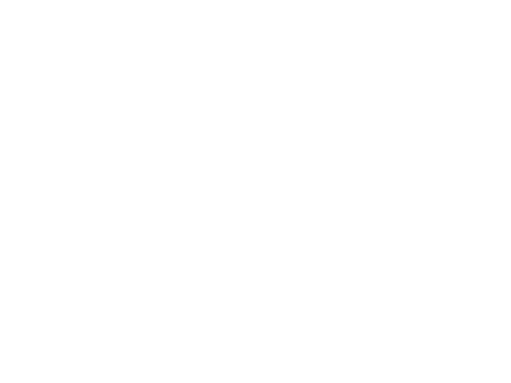
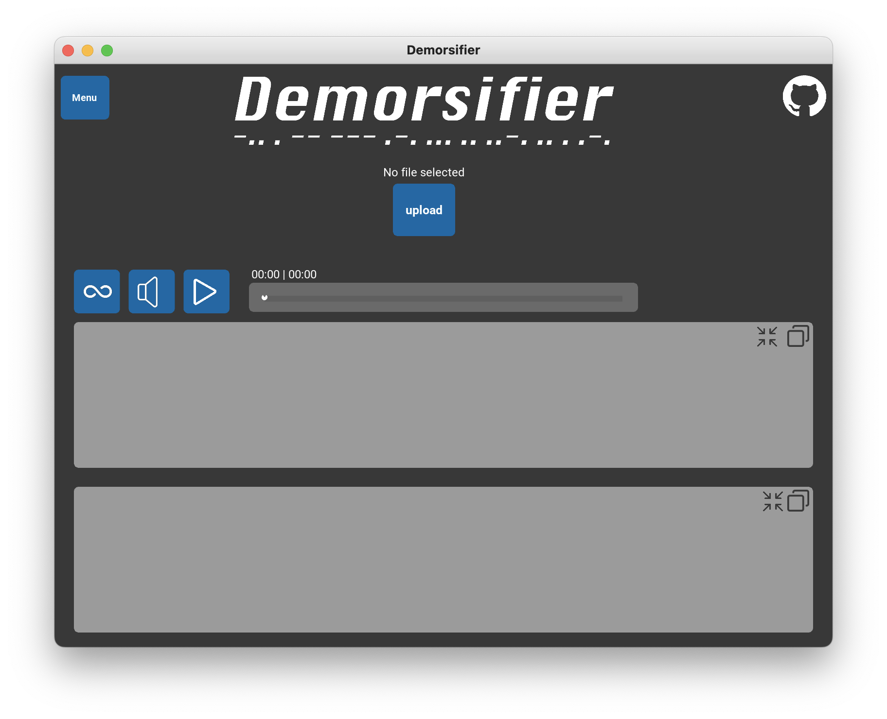
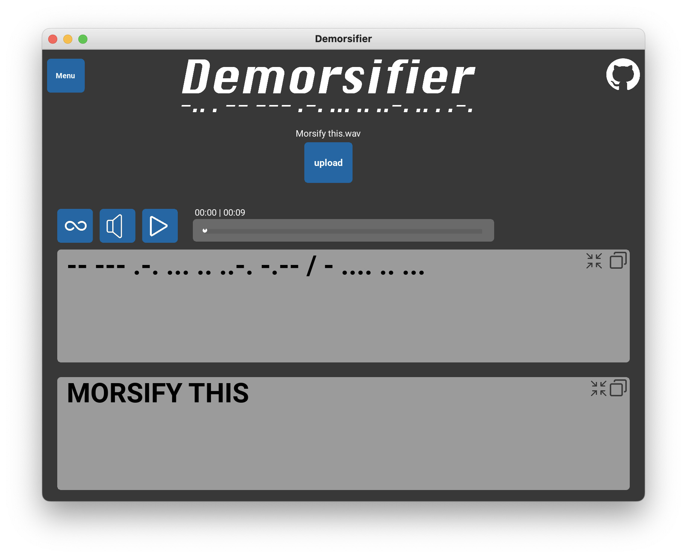
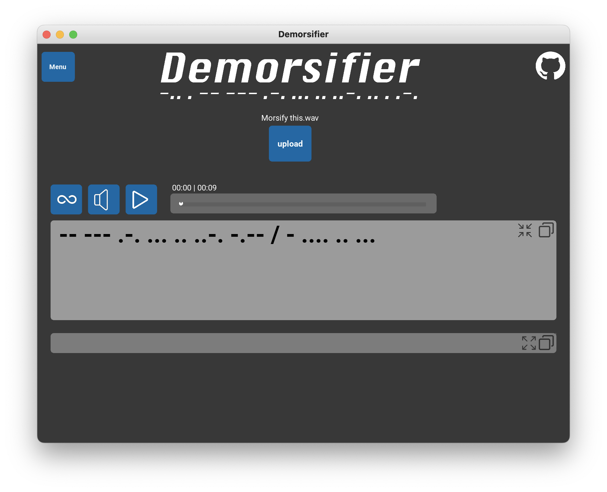
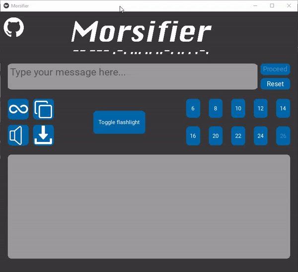

<div align="center">
    
</div>

<p align="center">A Kivy application to decrypt morsecode from audio files</p>

## Description

Demorsifier is an application that allows users to translate audiofiles including morsecode to text. It also includes our previous project 'Morsifier'.


## Getting Started

### Dependencies

- Python 3.7 to 3.10
- Kivy
- NumPy
- Pydub
- Soundfile
- SciPy

### Installing dependencies

#### Install Python 3.10.0

Download the Python installer from <a href="https://www.python.org/downloads/">Python's official website</a>, or install with <a href="https://brew.sh">Homebrew</a> by typing the following command in your terminal:
```
brew install python@3.10
```

#### Installing kivy 2.1.0

To install kivy follow the steps in their <a href="https://kivy.org/doc/stable/gettingstarted/installation.html">official guide</a>.

Make sure to install the full dependency "kivy[full]":
```
python -m pip install "kivy[full]"
```

#### Install Numpy, Pydub and SciPy

In your terminal type the following command (preferably inside your virtual environment):
```
pip install numpy

pip install pydub

pip install scipy
```

## Usage

### Executing the program

After installing all of the dependencies, run `main.py` in your editor of choice or navigate to the top folder in your virtual env and type the following command in your terminal:
```
python3 main.py
```
or
```
python3.10 main.py
```
Playing audio may not work for some Mac users. Try using Python 3.8 to open the app if this happens.

### Step-by-step
<div align="center"></div>
<p>There are only a few steps required to use Demorsifier. Press  and choose the morse audio file that you want to decrypt. The morse code will appear in the upper gray box, the decrypted text will appear in the lower gray box. The audio of the morse code will be played as well.</p>

<p> : When this button is pressed, the morse code audio will loop.</p>

<p> : If you don't want the morse code to be played as audio you can press the mute button.</p>

<p> : Press this button to start playing the morse audio.</p>

<p> : Next to the loop button, you'll find the copy-to-clipboard button. When pressed , the text in the gray box will be copied to your clipboard.</p>

<p> : Minimize the gray box by pressing this button.</p>


<p> : The audio can also be saved to your computer. To do this, press the download button.</p>

### Video example
Click on the image below to go to a Streamable video going over the program.<br /><br />
<a href="https://streamable.com/e/31x0wz" title="Video example"></a>

## Authors

- <a href="https://github.com/Hitijahujessy">@Hitijahujessy</a>
- <a href="https://github.com/MrWaltTG1">@MrWaltTG1</a>

## Version History

1.0
Initial Release

## License

This project is licensed under the MIT License - see the LICENSE.md file for details

## Acknowledgements 

<div> Download icon made by <a href="https://www.flaticon.com/authors/pixel-perfect" title="Pixel perfect"> Pixel perfect </a> from <a href="https://www.flaticon.com/" title="Flaticon">www.flaticon.com</a></div>
<div> Loop icon made by <a href="https://www.flaticon.com/authors/icon-wind" title="icon wind"> icon wind </a> from <a href="https://www.flaticon.com/" title="Flaticon">www.flaticon.com</a></div>
<div> Mute/Unmute/Copy icons made by <a href="https://www.freepik.com" title="Freepik"> Freepik </a> from <a href="https://www.flaticon.com/" title="Flaticon">www.flaticon.com</a></div>
